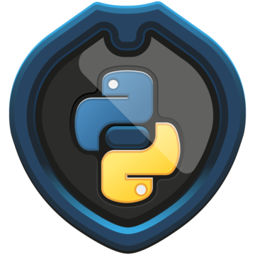

<div align="center">
  <h1> 30 Days Of Python: Day 10 - Loops</h1>
  <a class="header-badge" target="_blank" href="https://www.linkedin.com/in/fernandovicentinpavanello/">
  
  </a>
  <a class="header-badge" target="_blank" href="https://twitter.com/nandovicentin">
  
  </a>

  <sub>Author:
  <a href="https://www.linkedin.com/in/fernandovicentinpavanello/" target="_blank">Fernando Vicentin Pavanello</a><br>
  <small> First Edition: March, 2022</small>
  </sub>
</div>

[<< Day 9](../09_Day_Conditionals/09_conditionals.md) | [Day 11 >>](../11_Day_Functions/11_functions.md)


</div>

- [📘 Day 10](#-day-10)
  - [Loops](#loops)
    - [While Loop](#while-loop)
    - [Break and Continue - Part 1](#break-and-continue---part-1)
    - [For Loop](#for-loop)
    - [Break and Continue - Part 2](#break-and-continue---part-2)
    - [The Range Function](#the-range-function)
    - [Nested For Loop](#nested-for-loop)
    - [For Else](#for-else)
    - [Pass](#pass)

# 📘 Day 10

## Loops

Life is full of routines. In programming we also do lots of repetitive tasks. In order to handle repetitive task programming languages use loops. Python programming language also provides the following types of two loops:

  1. while loop
  2. for loop

### While Loop

We use the reserved word _while_ to make a while loop. It is used to execute a block of statements repeatedly until a given condition is satisfied. When the condition becomes false, the lines of code after the loop will be continued to be executed.

```py
# syntax
while condition:
    code goes here
```

**Example:**
```py
count = 0
while count < 5:
    print(count)
    count += 1
# print from 0 to 4
```

In the above while loop, the condition becomes false when count is 5. That is when the loop stops.
If we are interested to run block of code once the condition is no longer true, we can use _else_.

```py
  # syntax
while condition:
    code goes here
else:
    code goes here
```

**Example:**

```py
count = 0
while count < 5:
    print(count) # print from 0 to 4, then go to 'else'
    count += 1
else:
    print(count) # print 5
```

The above loop condition will be false when count is 5 and the loop stops, and execution starts the else statement. As a result 5 will be printed.

### Break and Continue - Part 1

- Break: We use break when we like to get out of or stop the loop.

```py
# syntax
while condition:
    code goes here
    if another_condition:
        break
```

**Example:**

```py
count = 0
while count < 5:
    print(count) # print 0, 1, 2
    count += 1
    if count == 3:
        break
```

The above while loop only prints 0, 1, 2, but when it reaches 3 it stops.

- Continue: With the continue statement we can skip the current iteration, and continue with the next:

```py
# syntax
while condition:
    code goes here
    if another_condition:
        continue
```

**Example:**

```py
count = 0
while count < 5:
    if count == 3:
        continue
    print(count)
    count += 1
```

The above while loop only prints 0, 1, 2 and 4 (skips 3).

### For Loop

A _for_ keyword is used to make a for loop, similar with other programming languages, but with some syntax differences. Loop is used for iterating over a sequence (that is either a list, a tuple, a dictionary, a set, or a string).

- For loop with list

```py
# syntax
for iterator in list:
    code goes here
```

**Example:**

```py
numbers = [0, 1, 2, 3, 4, 5]
for number in numbers: # number is temporary name to refer to the list's items, valid only inside this loop
    print(number)       # the numbers will be printed line by line, from 0 to 5
```

- For loop with string

```py
# syntax
for iterator in string:
    code goes here
```

**Example:**

```py
language = 'Python'
for letter in language:
    print(letter)


for i in range(len(language)):
    print(language[i])
```

- For loop with tuple

```py
# syntax
for iterator in tpl:
    code goes here
```

**Example:**

```py
numbers = (0, 1, 2, 3, 4, 5)
for number in numbers:
    print(number)
```

- For loop with dictionary
  Looping through a dictionary gives you the key of the dictionary.

```py
  # syntax
for iterator in dct:
    code goes here
```

**Example:**

```py
person = {
    'first_name':'Case',
    'last_name':'Sprawl',
    'age':43,
    'country':'Chiba City Blues',
    'is_machine':False,
    'skills':['Python', 'Linux', 'Cyber Security'],
    'address':{
        'street':'Jules Verne Street',
        'code':'L-5'
    }
}

for key in person:
    print(key)

for key, value in person.items():
    print(key, value) # this way we get both keys and values printed out
```

- Loops in set

```py
# syntax
for iterator in st:
    code goes here
```

**Example:**

```py
it_companies = {'Facebook', 'Google', 'Microsoft', 'Apple', 'IBM', 'Oracle', 'Amazon'}
for company in it_companies:
    print(company)
```

### Break and Continue - Part 2

Short reminder:
_Break_: We use break when we like to stop our loop before it is completed.

```py
# syntax
for iterator in sequence:
    code goes here
    if condition:
        break
```

**Example:**

```py
numbers = (0,1,2,3,4,5)
for number in numbers:
    print(number)
    if number == 3:
        break
```

In the above example, the loop stops when it reaches 3.

_Continue_: We use continue when we like to skip some of the steps in the iteration of the loop.

```py
  # syntax
for iterator in sequence:
    code goes here
    if condition:
        continue
```

**Example:**

```py
numbers = (0,1,2,3,4,5)
for number in numbers:
    print(number)
    if number == 3:
        continue
    print('Next number should be ', number + 1) if number != 5 else print("loop's end") # for short hand conditions need both if and else statements
print('outside the loop')
```

In the example above, if the number equals 3, the step *after* the condition (but inside the loop) is skipped and the execution of the loop continues if there are any iterations left.

### The Range Function

The _range()_ function is used list of numbers. The _range(start, end, step)_ takes three parameters: starting, ending and increment. By default it starts from 0 and the increment is 1. The range sequence needs at least 1 argument (end).
Creating sequences using range

```py
lst = list(range(11)) 
print(lst) # [0, 1, 2, 3, 4, 5, 6, 7, 8, 9, 10]
st = set(range(1, 11))    # 2 arguments indicate start and end of the sequence, step set to default 1
print(st) # {1, 2, 3, 4, 5, 6, 7, 8, 9, 10}

lst = list(range(0,11,2))
print(lst) # [0, 2, 4, 6, 8, 10]
st = set(range(0,11,2))
print(st) #  {0, 2, 4, 6, 8, 10}
```

```py
# syntax
for iterator in range(start, end, step):
```

**Example:**

```py
for number in range(11):
    print(number)   # prints 0 to 10, not including 11
```

### Nested For Loop

We can write loops inside a loop.

```py
# syntax
for x in y:
    for t in x:
        print(t)
```

**Example:**

```py
person = {
    'first_name':'Case',
    'last_name':'Sprawl',
    'age':43,
    'country':'Chiba City Blues',
    'is_machine':False,
    'skills':['Python', 'Linux', 'Cyber Security'],
    'address':{
        'street':'Jules Verne Street',
        'code':'L-5'
    }
}
for key in person:
    if key == 'skills':
        for skill in person['skills']:
            print(skill)
```

### For Else

If we want to execute some message when the loop ends, we use else.

```py
# syntax
for iterator in range(start, end, step):
    do something
else:
    print('The loop ended')
```

**Example:**

```py
for number in range(11):
    print(number)   # prints 0 to 10, not including 11
else:
    print('The loop stops at', number)
```

### Pass

In python when statement is required (after semicolon), but we don't like to execute any code there, we can write the word _pass_ to avoid errors. Also we can use it as a placeholder, for future statements.

**Example:**

```py
for number in range(6):
    pass
```

[<< Day 9](../09_Day_Conditionals/09_conditionals.md) | [Day 11 >>](../11_Day_Functions/11_functions.md)